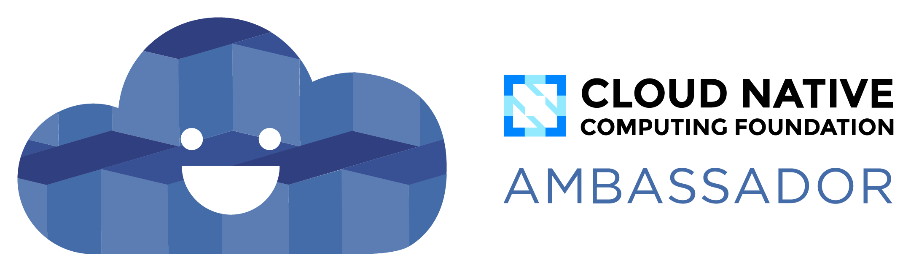

# persys-CI/CD
DevOps as a service !! **i am working on a public version that soon will be released here! read [Updates](#Updates)**
<!-- TOC -->
**[Architecture](#persys-cicd)**
 
**[Updates](#Updates)**
 
**[Contributions](#Contributions)**
 
**[Open Source]()**
 
**[Goals!](#Goals!)**
 
**[Project RoadMap]()**
 
**[Community](#community)**
 
**[Services Description]()**
 
**[Documentation](#Documentation)**
 
**[CNCF]()**
<!-- TOC -->
* this is the system design architecture which i came up with it's just a mind map to look at.
* feel free to open an ISSUE mentioning any problems or ideas you might have!

Open Source CI/CD pipeline management (DevOps as a Service) / orchestration written in Golang with a rust CLI client and next.js frontend,
this project provides tooling needed to take complete control over your CI/CD needs such as :
service discovery , datacenter aware API gateway, multi-environment deployments (Cloud Providers, Local Kubernetes cluster) , traffic monitoring , automatic rollbacks , end-to-end testing , monitoring and health checks using Grafana and Prometheus, services catalogue , and much more!
# Updates
* **[8/12/2022] this whole thing is written by me so there's a lot to work on, i'll really appreciate any help!**
* **[10/3/2022] getting my hands on the hardware and infrastructures needed for developing this project has costs please consider donating to us!**
* **[12/24/2022] I'm actively trying to build a community so please at lease give us a star or contribute to our cause!**
* **[12/30/2022] currently the project has hard coded personal / sensitive data in it i'll release the first working version soon to our open source repository which is : https://github.com/miladhzzzz/persys-cicd**

# Contributions
**Currently we are looking for contributors in fields of expertise listed below:**
 
* DevOps Engineers
* UI/UX Designer
* Frontend react, next.js engineer
* Golang developers
* Rust developers
* Cloud network engineers
* Datacenter Architectures and designers
* Software test specialist
* Project managers
 
**please refer to [Community]() section and consider joining us**

# Open Source Tech We Use
* [Backstage](https://github.com/backstage/backstage)
* [apache kafka](https://github.com/obsidiandynamics/kafdrop)
* [gRPC](https://github.com/grpc)
* [Git]()
* [Rust (Programming Language)]()
* [Terraform]()
* [Kubernetes]()
* [Go (Programming Language)]()
* [Opentelemtry](https://github.com/opentelemtry)
* [Watermill](https://github.com/watermill)
* [Mongodb](https://github.com/mongodb)
* [Signoz](https://github.com/signoz)
* [Kafdrop](https://github.com/obsidiandynamics/kafdrop)
* [Ceph](https://github.com/ceph)
* [Github](https://github.com)

# Goals!
* the goal of this project is to have a devops platform like https://dev.azure.com that does much more than CI/CD!
for example when you sign up for our platform you will be able to bring up a fully managed kubernetes cluster to have and End-To-End experience from your IDE right to production!
* or you can connect to your on premise VMware Infrastructure and fully automate your local dev environments
* second goal is to provide developers , computer science enthusiasts, organizations with an easy to use cloud service provider that has it all! (DevOps, SysOps , MLOps, DevSecOps, Developer portal and Everything As A service)
* multi environment deployments! you can deploy and manage your software across different Cloud Service Providers and your local developer environment.

# Project Road Map
* Q1 2023 : Clean UP the code repository for and rebase to public repository.
* Q1 2023 : Build our Community to help develop, manage , market our product
* Q1 2023 : Test First Working version!
* Q2 2023 : Submit project to CNCF sandbox projects and integrate our community with the world!
* Q2 2023 : Hopefully we can get our hands on Infrastructure needed to launch our Hosted version of our software.
* Q3 2023 : Grow our Community and hire people to help!
* Q4 2023 : Release the software for on premise use (hosting it yourself).
* Q4 2023 : World Dominance :D.

# community
  **Our primary goal in this project as we discussed before is to build a community of iranian highly skilled
  specialists to help each other and junior developers in a way that we can write great software that is maintained by
  community contributions.**
   
  and of course integrating our community with the world of Open Source!
   
  we can find a lot of great software that is written by millions of Open Source contributors accross the globe in https://github.com/readme
   
  you can join "your" community and start contributing in various projects! please visit our slack or discord (will be updated soon) to ask around and have a dialogue with others!
   
  https://join.slack.com/t/persys-cicd/shared_invite/zt-1lje1wst0-E0TjKMIXGe1FGLex1uQoxg

# Services Description
* [api-gateway](https://github.com/miladhzzzz/persys-cicd) : a pretty basic api gateway that talks to the whole system and handles authorization, notification, user management (clients send http rest calls and we generate gRPC calls to microservices and use kafka to check on jobs)
* [ci-service](https://github.com/miladhzzzz/persys-cicd) : obviously does ci server stuff build your code test it and push it to a private and/or multiple repositories
* [clients](https://github.com/miladhzzzz/persys-cicd) : this contains client libraries for our project including a RUST CLI app and NextJS web Frontend
* [github-manager](https://github.com/miladhzzzz/persys-cicd) : github manager basically gets webhooks from github and parses them to trigger an event for our system it can be triggered manually with a http request with a json body too
* [shipper](https://github.com/miladhzzzz/persys-cicd) : shipper deploys your code to different types of environments (Cloud, On-Prem , etc...) and does end to end tests
* [theye](https://github.com/miladhzzzz/persys-cicd) : theye will keep an on "EYE" on system state and try to get desired state of the whole system talking to DCIMT and ci-service , shipper
* [DCIMT](https://github.com/miladhzzzz/persys-cicd) : DataCenter Inter-Connect Management Tool is responsible for Infrastructure as a service state keeping again working in multi envrionments (cloud , on-prem)

# Documentation
* the documentation will be located at https://github.com/miladhzzzz/persys-cicd/docs

# Cloud Native Computing Foundation
 
and of course we are trying to get in Cloud Native Computing Foundation and as we mentioned above we are using and supporting a lot of CNCF technologies
 
so, thank you 

[CNCF](https://github.com/miladhzzzz/persys-cicd) <3

