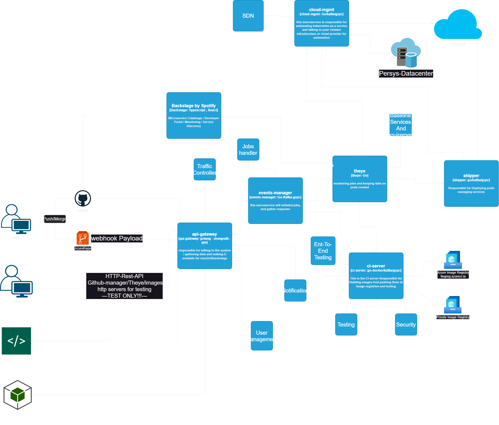
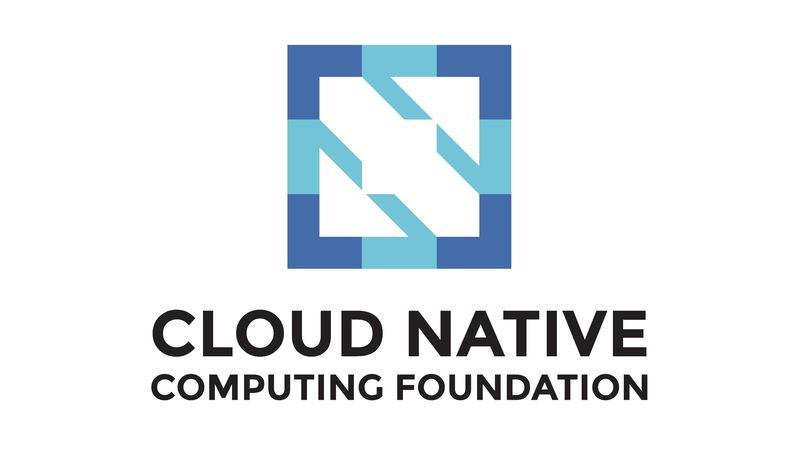

# persys-CI/CD 
i am cleaning up the code for a public repo :) be patient im code shy :D
full CI/CD orchestration project written in golang , rust , next.js
<!-- TOC -->
* [persys-CI/CD](#persys-cicd)
<!-- TOC -->

Open Source CI/CD pipeline management / orchestration written in Golang with a rust CLI client and next.js frontend,
this project provides tooling needed to take complete control over your CI/CD needs such as :
service discovery , datacenter aware API gateway, multi-environment deployments (Cloud Providers, Local Kubernetes cluster) , traffic monitoring , automatic rollbacks , end-to-end testing , monitoring and health checks using Grafana and Prometheus, services catalogue , and much more!

**technologies we use**
* [Backstage](https://github.com/obsidiandynamics/kafdrop)
* [apache kafka](https://github.com/obsidiandynamics/kafdrop)
* [gRPC](https://github.com/obsidiandynamics/kafdrop)
* Git
* Rust (Programming Language)
* Terraform
* Kubernetes
* Go (Programming Language)
* [Opentelemtry](https://github.com/obsidiandynamics/kafdrop)
* [Watermill](https://github.com/obsidiandynamics/kafdrop)
* [Mongodb](https://github.com/obsidiandynamics/kafdrop)
* [Signoz](https://github.com/obsidiandynamics/kafdrop)
* [Kafdrop](https://github.com/obsidiandynamics/kafdrop)

**Services Description**
* [api-gateway](https://github.com/obsidiandynamics/kafdrop) : a pretty basic api gateway that talks to the whole system and handles authorization, notification, user management (clients send http rest calls and we generate gRPC calls to microservices and use kafka to check on jobs)
* [ci-service](https://github.com/obsidiandynamics/kafdrop) : obviously does ci server stuff build your code test it and push it to a private and/or multiple repositories
* clients : this contains client libraries for our project including a RUST CLI app and NextJS web Frontend
* github-manager : github manager basically gets webhooks from github and parses them to trigger an event for our system it can be triggered manually with a http request with a json body too
* shipper : shipper deploys your code to different types of environments (Cloud, On-Prem , etc...) and does end to end tests
* theye : theye will keep an on "EYE" on system state and try to get desired state of the whole system talking to DCIMT and ci-service , shipper
* DCIMT : DataCenter Inter-Connect Management Tool is responsible for Infrastructure as a service state keeping again working in multi envrionments (cloud , on-prem)

**Cloud Native Computing Foundation**
 
and of course we are trying to be in Cloud Native Computing Foundation and as we mentioned above we are using and supporting a lot of CNCF technologies
 
so, thank you CNCF <3 
 

